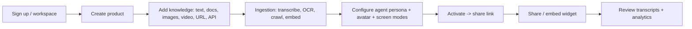
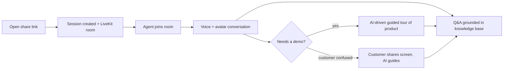

# SalesAI — Product Vision

> **Version**: 1.0 · **Date**: June 2026

---

## 1. The big idea

SalesAI replaces (or augments) a human sales representative with a **realtime,
multimodal AI agent** that genuinely *knows* a product and can *show* it.

A seller uploads everything that describes their product — marketing copy,
technical docs, demo videos, screenshots, and even **live access to the running
software** (a cloud dashboard URL, an API, or an MCP server). SalesAI turns all
of it into a knowledge base, wraps it in an agent persona, and produces a
**single shareable link**.

When a prospective customer opens that link, they meet a **talking, visual AI
sales rep** that:

- answers any question about the product, at the depth the customer wants;
- **drives a live tour** of the actual product UI ("let me show you how billing
  works…") while narrating and highlighting;
- **watches the customer's shared screen** and guides them ("click the blue
  *Settings* button, top-right");
- adapts tone for a non-technical buyer vs. a hands-on engineer.

It is, in effect, a tireless product expert that any company can hand to every
visitor at once.

---

## 2. Who it is for

- **SaaS companies** that want pre-sales demos and onboarding at scale.
- **Hardware / complex-product vendors** who need a knowledgeable explainer.
- **Marketplaces / agencies** embedding an expert assistant on client sites.

Two primary personas:

- **Seller (our customer)** — configures products, uploads knowledge, designs
  the agent persona, activates links, and reviews conversation analytics.
- **Visitor (the seller's prospect)** — opens a link and has a natural,
  face-to-face conversation with the AI rep.

---

## 3. Seller journey

1. **Create a product** in a workspace.
2. **Add knowledge sources** of any type. Live software is added as a URL (for
   crawling) and optionally as API/MCP access for real-time answers.
3. **Ingestion** runs in the background: video/audio is transcribed, images are
   described, URLs are crawled, everything is chunked and embedded.
4. **Configure the agent**: name, tone, language, goals, guardrails, which
   avatar provider to use, and which screen modes to allow.
5. **Activate** to mint a public share link (and an embeddable widget snippet).
6. **Analyze** conversations: topics asked, objections, drop-off, sentiment.

---

## 4. Visitor journey

- **Zero install, zero account.** Click the link, allow mic, start talking.
- The agent **sees and is seen**: a visual avatar face speaks in real time.
- The agent can **share its screen** to demonstrate the live product, or watch
  the **customer's screen** to troubleshoot.
- Everything the agent says is **grounded** in the seller's knowledge base.

---

## 5. What makes it different

- **Multimodal ingestion** — not just docs; real demo videos, screenshots, and
  the live product itself become knowledge.
- **Two-way screen intelligence** — the agent both demonstrates (drives a
  browser) and observes (reads the customer's shared screen).
- **Pluggable realism** — avatar and voice providers are swappable per agent, so
  we can dial cost vs. realism without re-architecting.
- **Grounded + tool-using** — retrieval keeps answers truthful; optional live
  tool/API access lets it answer about real product state, not just docs.

---

## 6. Success metrics

- Time-to-first-answer and conversation latency (target sub-second turn-taking).
- Knowledge coverage / hallucination rate (measured with an eval set).
- Demo completion rate, qualified-lead rate, and seller activation rate.

---

## 7. Phased delivery

| Phase | Theme | Outcome |
|---|---|---|
| 0 | Foundation | Monorepo, auth, DB, infra, CI |
| 1 | Knowledge & RAG | Ingest any source; text chat Q&A grounded in it |
| 2 | Realtime agent | Voice + avatar + share link + visitor app |
| 3 | Screen intelligence | Guided tour + customer-shared-screen guidance |
| 4 | Mobile & scale | Expo app, analytics, multi-provider hardening, SDK |

Each phase ships a working, demoable slice. Details live in the phase docs under
`md/backend`, `md/web`, and `md/mobile`.
