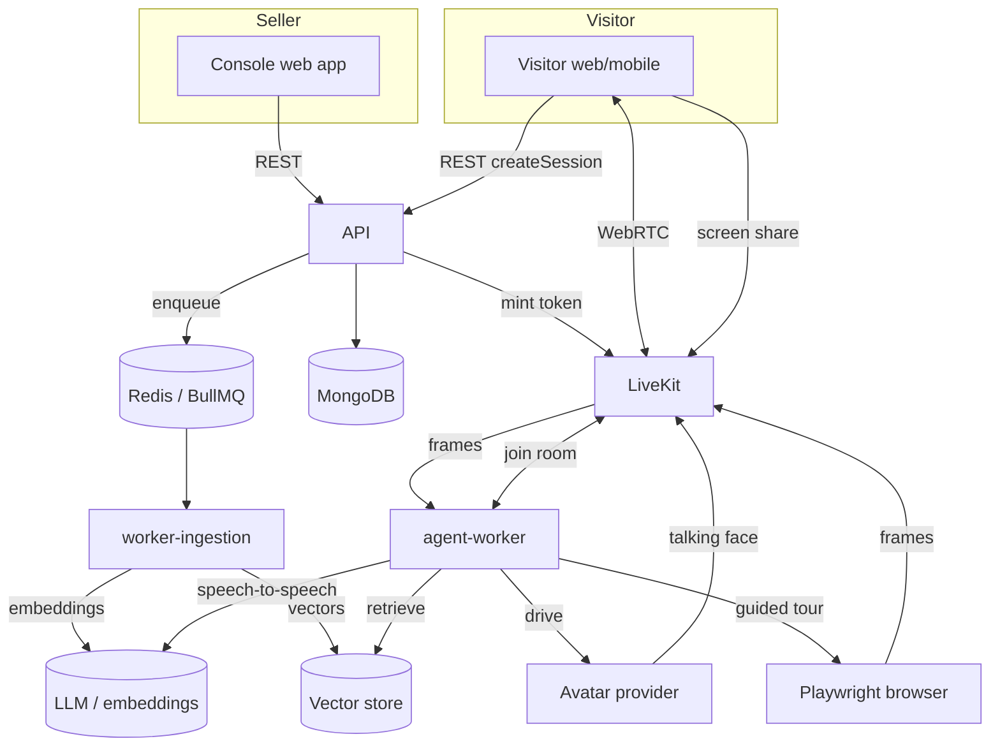

# SalesAI — Technical Architecture

> **Version**: 1.0 · **Date**: June 2026
> **Monorepo**: Turborepo + npm workspaces · **Language**: JavaScript (JSDoc) · **Modules**: ESM

---

## 1. Monorepo structure

```
salesai-monorepo/
├── turbo.json
├── package.json
├── eslint.config.js
├── .env.example
├── infra/
│   └── docker-compose.yaml        # mongodb-atlas-local, redis, minio, qdrant, livekit
│
├── apps/
│   ├── api/                       # Express + Socket.IO REST + LiveKit token issuing
│   ├── console/                   # Seller dashboard (React 19 + Vite)
│   ├── visitor/                   # Public agent experience (React 19 + Vite)
│   ├── agent-worker/              # LiveKit Node agent (the realtime brain)
│   ├── worker-ingestion/          # BullMQ heavy jobs (transcribe, OCR, crawl, embed)
│   ├── worker-general/            # BullMQ light jobs (link expiry, session cleanup)
│   └── mobile/                    # Expo visitor app
│
└── packages/
    ├── ai/                        # LLM + embeddings + multimodal (strategy)
    ├── rag/                       # chunk + ingest + retrieve + vector stores
    ├── avatar/                    # avatar provider strategies
    ├── screen/                    # guided tour (Playwright) + frame vision
    ├── agent/                     # persona prompt + tool definitions
    ├── livekit/                   # token + room helpers
    ├── contracts/                 # shared Zod schemas
    ├── database/                  # Mongoose models + connection
    ├── auth/                      # JWT + password hashing + middleware
    ├── access/                    # RBAC (workspace roles)
    ├── realtime/                  # Socket.IO server + Redis adapter
    ├── storage/                   # S3-compatible object storage
    ├── queue/                     # BullMQ queues + workers
    ├── config-env/                # Zod-validated env loader
    ├── logger/                    # pino structured logging
    ├── ui/                        # shared React components
    ├── tailwind-config/           # Tailwind v4 tokens/preset
    ├── validation/                # Zod request validation middleware
    ├── utils/                     # shared helpers (ids, retry, chunk)
    ├── testing/                   # vitest preset + factories
    ├── eslint-config/             # shared flat ESLint config
    ├── typescript-config/         # shared tsconfig (for JSDoc type-checking)
    └── sdk/                       # embeddable widget
```

---

## 2. Design principles

| Principle | How |
|---|---|
| **Strategy pattern everywhere** | LLM, embeddings, avatar, vector store, STT/TTS, screen backend are all swappable behind a factory. New providers added without touching callers. |
| **Single responsibility per package** | Each `packages/*` owns one domain; apps compose them. |
| **Grounded by default** | The agent answers from retrieval; tools fetch live state. No free-form claims. |
| **Event-driven ingestion** | Heavy media work runs in BullMQ workers, decoupled from the API. |
| **Multi-tenant** | Everything is scoped by `workspaceId` -> `productId`. Retrieval is filtered by `productId`. |
| **Provider-agnostic realtime** | LiveKit rooms are the meeting point for visitor, agent, avatar, and screen tracks. |

---

## 3. System overview



---

## 4. Data stores

| Store | Use | Library |
|---|---|---|
| **MongoDB** | Primary datastore: users, workspaces, products, knowledge sources, agents, share links, sessions, messages, **and knowledge chunks + embeddings** | Mongoose |
| **MongoDB Atlas Vector Search** | Default vector index over `knowledgechunks.embedding` (`$vectorSearch`) | Atlas Search |
| **Qdrant** | Alternative/scale vector store (`VECTOR_STORE=qdrant`) | `@qdrant/js-client-rest` |
| **Redis** | Job queues (BullMQ), Socket.IO pub/sub, caching | ioredis |
| **S3 / MinIO** | Uploaded documents, images, video; presigned upload/download | AWS SDK v3 |

Local dev uses the `mongodb/mongodb-atlas-local` image so Vector Search works
without Atlas cloud. See [`infra/docker-compose.yaml`](../infra/docker-compose.yaml).

---

## 5. Services (apps)

### 5.1 `apps/api` — Express + Socket.IO
- REST endpoints for products, knowledge, agents, sessions (see
  [`03_data_model_and_api.md`](./03_data_model_and_api.md)).
- Mints **LiveKit tokens** when a visitor starts a session.
- Enqueues **ingestion jobs** when knowledge is added.
- Emits Socket.IO events to the console (ingestion progress, live sessions).
- Middleware chain: `helmet -> cors -> json -> auth -> rbac -> zod validation`.

### 5.2 `apps/agent-worker` — LiveKit Node agent
- Runs `@livekit/agents`. LiveKit dispatches it into a visitor's room.
- Loads agent config, builds **persona prompt** + **tools** (`@repo/agent`).
- Runs **speech-to-speech** via the OpenAI Realtime plugin (or chained pipeline).
- Attaches the configured **avatar** (`@repo/avatar`).
- Owns the **GuidedTour** browser and **screen-frame** sampling (`@repo/screen`).

### 5.3 `apps/worker-ingestion` — BullMQ
- Consumes `ingestion` queue. For each source, extracts text by modality
  (transcribe video/audio, describe images, crawl URLs, parse docs), then calls
  the RAG pipeline (chunk -> embed -> upsert).

### 5.4 `apps/worker-general` — BullMQ
- Link expiry, stale session cleanup, scheduled maintenance.

### 5.5 `apps/console` / `apps/visitor` / `apps/mobile`
- See [`md/web`](./web) and [`md/mobile`](./mobile) phase docs.

---

## 6. Package responsibilities (selected)

- **`@repo/ai`** — `getLLM()` (OpenAI/Anthropic), `embed()/embedBatch()`,
  `describeImage()/transcribeAudio()`.
- **`@repo/rag`** — `chunkText()`, `ingestSource()`, `retrieve()`,
  `getVectorStore()` (Mongo Atlas / Qdrant).
- **`@repo/avatar`** — `getAvatarProvider()` (voice-only/tavus/simli/heygen/did).
- **`@repo/screen`** — `GuidedTour` (Playwright), `analyzeFrame()` (vision).
- **`@repo/agent`** — `buildSystemPrompt()`, `buildTools()`.
- **`@repo/livekit`** — `createAccessToken()`, `roomService()`.
- **`@repo/database`** — `connectDB()` + Mongoose models.

---

## 7. Realtime model

LiveKit is the shared room. Participants:

1. **Visitor** — publishes mic (and optionally a screen-share track).
2. **agent-worker** — subscribes to visitor audio; publishes agent audio; reads
   frames for screen understanding; publishes guided-tour video.
3. **Avatar** — publishes a video track (Tavus/HeyGen/D-ID) or is rendered
   client-side (Simli), lip-synced to the agent audio.

Turn-taking, interruption, and VAD are handled by the agents framework /
realtime model. See [`02_ai_realtime_avatar_screen.md`](./02_ai_realtime_avatar_screen.md).

---

## 8. Environments & config

- All config via env, validated with `@repo/config-env` (Zod) at boot.
- See [`.env.example`](../.env.example) for the full list.
- Secrets (API keys) are never committed; providers are toggled by env.

---

## 9. Deployment (target)

| Layer | Choice |
|---|---|
| API / workers / agent-worker | Containerized Node services (autoscaled) |
| Socket.IO scaling | Redis adapter (multi-pod) |
| LiveKit | LiveKit Cloud or self-hosted SFU |
| MongoDB | Atlas (Vector Search enabled) |
| Vector store | Atlas Vector Search (or managed Qdrant) |
| Object storage | S3 + CDN |
| Web apps | Vite build -> CDN/static host |
| SDK loader | `@repo/sdk` built + served from a versioned CDN route |
| CI/CD | GitHub Actions -> Docker -> deploy (lint -> test -> build -> push) |

---

## 10. Cross-cutting concerns (later phases)

These span all services and are detailed in the phase docs:

| Concern | Where | Phase |
|---|---|---|
| **Analytics & insights** | `worker-general` post-call analysis, `analytics` API, console dashboard | 4 |
| **Embeddable SDK/widget** | `@repo/sdk` loader, embed tokens + origin allowlist, `?embed=1` visitor UI | 5 |
| **Team & billing** | `@repo/access` RBAC, Stripe subscriptions, usage metering + quotas | 6 |
| **Observability** | OpenTelemetry traces, Prometheus metrics, `/health` + `/ready`, provider fallback + circuit breakers | 7 |
| **Security & compliance** | refresh rotation + 2FA + API keys, PII redaction + retention TTLs, `AuditLog`, secrets manager | 8 |
| **Autoscale** | HPA on API/workers; agent-worker scales on concurrent LiveKit rooms; Socket.IO Redis adapter | 8 |
