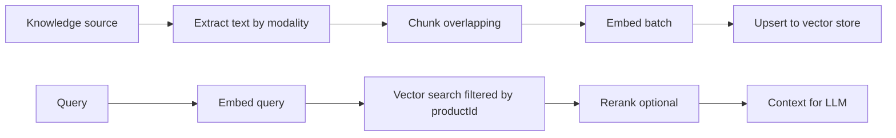
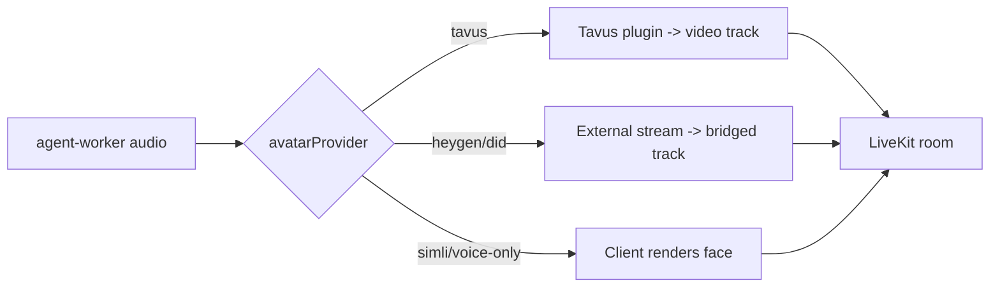
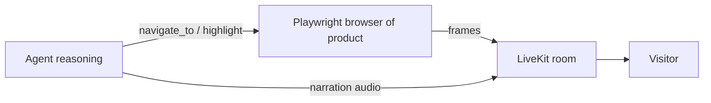
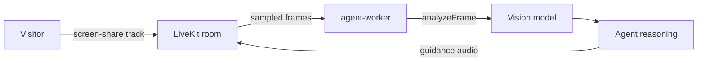

# SalesAI — AI, Realtime, Avatar & Screen Intelligence

> The deep dive into the parts that make the agent feel like a real sales rep.

---

## 1. Knowledge & RAG

### 1.1 Pipeline

### 1.2 Extraction by modality

| Source type | Extraction |
|---|---|
| `text` | Used as-is |
| `document` (PDF/DOCX) | `pdf-parse` / `mammoth` -> text |
| `image` (screenshot/diagram/photo) | Vision model `describeImage()` -> rich caption |
| `video` | Extract audio (ffmpeg) -> transcribe (`gpt-4o-transcribe` / faster-whisper) + sample ~1 keyframe/sec -> describe; concatenate transcript + frame captions |
| `url` | Fetch + strip HTML (SPA pages rendered with Playwright); deeper crawl follows internal links |
| `api` | Read OpenAPI/MCP descriptors; index endpoint docs; also enables **live tool access** |

Implemented in `apps/worker-ingestion` ->
[`handlers/ingest-source.js`](../apps/worker-ingestion/src/handlers/ingest-source.js).

### 1.3 Chunking & embeddings

- `chunkText()` splits on sentence boundaries (~1200 chars, 200 overlap) —
  [`packages/rag/src/chunk.js`](../packages/rag/src/chunk.js).
- Embeddings via OpenAI `text-embedding-3-large` (3072 dims) —
  [`packages/ai/src/embeddings.js`](../packages/ai/src/embeddings.js).
- Each chunk stores `productId`, `sourceId`, `modality`, `text`, `embedding`,
  `metadata` for filtered retrieval and citations.

### 1.4 Vector store (strategy)

`getVectorStore()` returns one of:

- **MongoVectorStore** (default) — `$vectorSearch` against the `vector_index`
  Atlas index, filtered by `productId`/`modality`.
  [`packages/rag/src/stores/mongo.store.js`](../packages/rag/src/stores/mongo.store.js)
- **QdrantVectorStore** — `VECTOR_STORE=qdrant`, for scale or self-host.
  [`packages/rag/src/stores/qdrant.store.js`](../packages/rag/src/stores/qdrant.store.js)

Create the index once: `npm run db:indexes`
([`sync-indexes.js`](../packages/database/scripts/sync-indexes.js)).

### 1.5 Retrieval & grounding

- `retrieve({ productId, query, topK })` embeds the query and returns top
  chunks. Optional cross-encoder rerank can be added before context assembly.
- The agent calls retrieval through the `search_knowledge` tool, so it decides
  when to look things up mid-conversation.
- **Hybrid search** (dense + BM25/text) and **reranking** are the first quality
  upgrades once the base loop works (see Phase 1 backend doc).

---

## 2. Realtime conversational agent

### 2.1 Where it runs

`apps/agent-worker` uses `@livekit/agents` (Node). LiveKit dispatches the worker
into the visitor's room. The worker:

1. Loads the `Agent` + `Product` for the room's `Session`.
2. Builds the **system prompt** (`buildSystemPrompt`) and **tools** (`buildTools`).
3. Starts a `voice.AgentSession` with a realtime model.
4. Attaches the configured avatar.

See [`apps/agent-worker/src/agent.js`](../apps/agent-worker/src/agent.js).

### 2.2 LLM strategy

Two interchangeable modes:

- **Speech-to-speech (default)** — OpenAI Realtime API (`gpt-realtime-2`).
  Lowest latency, natural turn-taking, native interruption, tool calls.
- **Chained pipeline** — STT (Deepgram / faster-whisper) -> LLM (GPT/Claude via
  `@repo/ai`) -> TTS (ElevenLabs / Cartesia). More control, more providers,
  slightly higher latency.

Selected via env (`LLM_PROVIDER`, `OPENAI_REALTIME_MODEL`, `STT_PROVIDER`,
`TTS_PROVIDER`).

### 2.3 Tools (function calling)

Defined in [`packages/agent/src/tools.js`](../packages/agent/src/tools.js):

- `search_knowledge(query, topK)` — RAG retrieval.
- `start_guided_tour(url)` — open the live product for a demo.
- `navigate_to(url)` — move the demo browser.
- `highlight(selector)` — point at an element.
- `read_customer_screen(question)` — interpret the customer's shared screen.

The agent-worker injects handlers for the tour/screen tools (it owns those
objects); `search_knowledge` only needs `productId`.

### 2.4 Live tool / MCP access (optional)

If the agent's `toolAccess.enabled` is set, the agent can call the seller's real
product (REST via OpenAPI, or an MCP server) so it answers about **live state**
("your current plan is Pro, you have 3 seats left") rather than only static docs.
The Realtime API supports remote MCP servers directly.

---

## 3. Avatar (visual face) — strategy pattern

The avatar provider is chosen by the **developer** per agent
(`agent.avatarProvider`), not by the end user.
[`packages/avatar`](../packages/avatar/src/index.js).

| Provider | How it renders | Notes |
|---|---|---|
| `voice-only` | Client draws a 2D orb/waveform from audio levels | Cheapest, default for dev |
| `tavus` | LiveKit Node plugin publishes photoreal video, lip-synced | Best for digital-twin realism |
| `simli` | Client `simli-client` (LiveKit mode), sub-100ms face | Lowest latency, client-driven |
| `heygen` | HeyGen Interactive Avatar (LiveKit-backed), 720p | Enterprise realism, text-stream driven |
| `did` | D-ID streaming avatar from a photo | Presenter-style |

Each provider implements `start({ agentSession, room })` and
`getClientConfig()`. Server-rendered providers (Tavus) publish a video track;
client-rendered providers (Simli, voice-only) return config the visitor app uses
to render the face. The agent's audio is the single source of truth that all
providers lip-sync to.

---

## 4. Screen intelligence — both directions

The seller can enable either or both modes per agent (`agent.screenModes`).

### 4.1 Mode A — AI-driven guided tour (agent shows the product)

The agent opens a **real browser** of the seller's product URL, navigates,
highlights elements, and narrates — while the customer watches.

- Backend: `GuidedTour` (Playwright) —
  [`packages/screen/src/cobrowse.js`](../packages/screen/src/cobrowse.js).
- Optional: Browserbase + Stagehand for a cloud browser with a computer-use
  agent that can follow natural-language steps ("go to billing and show how to
  add a seat").
- The tour's screenshots/video frames are published into the LiveKit room as the
  agent's video, so the customer sees the live UI plus the avatar.

### 4.2 Mode B — customer-shared-screen guidance (agent watches)

The customer shares their screen; the agent samples ~1 frame/sec, sends it to a
vision model, and guides the next action.

- `analyzeFrame(frameDataUrl, question)` —
  [`packages/screen/src/vision.js`](../packages/screen/src/vision.js).
- Exposed to the LLM as the `read_customer_screen` tool, so the agent can choose
  to "look" when the customer is stuck.

---

## 5. Cost & latency notes

- **Realtime audio is the dominant cost.** `gpt-realtime-2` is ~\$32/1M audio-in
  and ~\$64/1M audio-out tokens; use prompt caching, trim conversation context,
  and consider a mini realtime model for simpler agents.
- **Avatars are per-minute.** voice-only is free; Simli ≈ \$0.10–0.20/min;
  HeyGen ≈ \$0.05/sec (720p). Pick per agent based on the deal size.
- **Embeddings/ingestion** are cheap and one-time per source; transcription is
  the main ingestion cost for video.
- **Guided tour** runs a headless browser per session — pool/limit concurrency;
  Browserbase offloads this at a per-session price.
- Cache retrieval results per (product, normalized-query) where useful.

---

## 6. Evaluation & guardrails

- **Grounding eval** — golden Q&A set per product; measure answer accuracy and
  hallucination rate (RAGAS-style).
- **Guardrails** — persona-level rules (no unverifiable pricing/legal claims),
  retrieval-required answering, and "I don't know -> offer follow-up".
- **Transcripts** — every turn stored in `messages` for review, analytics, and
  eval dataset growth.
