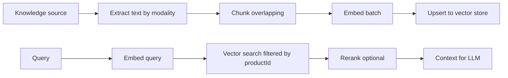
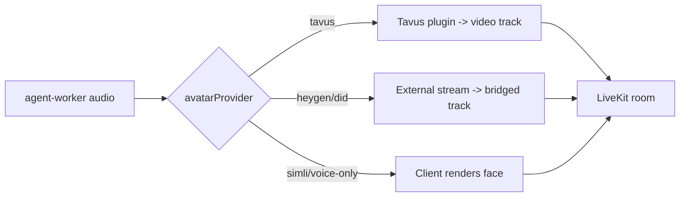
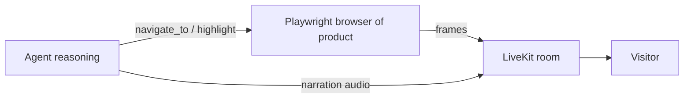
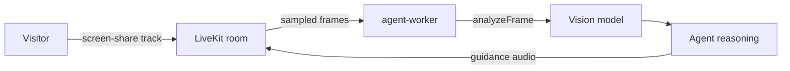

# SalesAI — AI, Realtime, Avatar & Screen Intelligence

> The deep dive into the parts that make the agent feel like a real sales rep.

---

## 1. Knowledge & RAG

### 1.1 Pipeline

```mermaid
flowchart LR
    Src[Knowledge source] --> Ext[Extract text by modality]
    Ext --> Chunk[Chunk overlapping]
    Chunk --> Emb[Embed batch]
    Emb --> Up[Upsert to vector store]
    Q[Query] --> QEmb[Embed query]
    QEmb --> Search[Vector search filtered by productId]
    Search --> Rerank[Rerank optional]
    Rerank --> Ctx[Context for LLM]
```

### 1.2 Extraction by modality

| Source type | Extraction |
|---|---|
| `text` | Used as-is |
| `document` (PDF/DOCX) | `pdf-parse` / `mammoth` -> text |
| `image` (screenshot/diagram/photo) | Vision model `describeImage()` -> rich caption |
| `video` | Extract audio (ffmpeg) -> transcribe (`gpt-4o-transcribe` / faster-whisper) + sample up to `VIDEO_MAX_KEYFRAMES` evenly-spaced keyframes -> describe (`describeImage()`); concatenate transcript + frame captions |
| `url` | Fetch + strip HTML (SPA pages rendered with Playwright); same-origin BFS crawl follows internal links up to `URL_CRAWL_MAX_PAGES` pages, reusing the product's demo-session auth on every page |
| `api` | Read OpenAPI/MCP descriptors; index endpoint docs; also enables **live tool access** |

Implemented in `apps/worker-ingestion` ->
[`handlers/ingest-source.js`](../apps/worker-ingestion/src/handlers/ingest-source.js).

### 1.3 Chunking & embeddings

- `chunkText()` splits on sentence boundaries (~1200 chars, 200 overlap) —
  [`packages/rag/src/chunk.js`](../packages/rag/src/chunk.js).
- Embeddings via OpenAI `text-embedding-3-large` (3072 dims) —
  [`packages/ai/src/embeddings.js`](../packages/ai/src/embeddings.js).
- Each chunk stores `productId`, `sourceId`, `modality`, `text`, `embedding`,
  `metadata` for filtered retrieval and citations.

### 1.4 Vector store (strategy)

`getVectorStore()` returns one of:

- **MongoVectorStore** (default) — `$vectorSearch` against the `vector_index`
  Atlas index, filtered by `productId`/`modality`.
  [`packages/rag/src/stores/mongo.store.js`](../packages/rag/src/stores/mongo.store.js)
- **QdrantVectorStore** — `VECTOR_STORE=qdrant`, for scale or self-host.
  [`packages/rag/src/stores/qdrant.store.js`](../packages/rag/src/stores/qdrant.store.js)

Create the index once: `npm run db:indexes`
([`sync-indexes.js`](../packages/database/scripts/sync-indexes.js)).

### 1.5 Retrieval & grounding

- `retrieve({ productId, query, topK })` embeds the query and returns top
  chunks. Optional cross-encoder rerank can be added before context assembly.
- The agent calls retrieval through the `search_knowledge` tool, so it decides
  when to look things up mid-conversation.
- **Hybrid search** (dense + BM25/text) and **reranking** are the first quality
  upgrades once the base loop works (see Phase 1 backend doc).

---

## 2. Realtime conversational agent

### 2.1 Where it runs

`apps/agent-worker` uses `@livekit/agents` (Node). LiveKit dispatches the worker
into the visitor's room. The worker:

1. Loads the `Agent` + `Product` for the room's `Session`.
2. Builds the **system prompt** (`buildSystemPrompt`) and **tools** (`buildTools`).
3. Starts a `voice.AgentSession` with a realtime model.
4. Attaches the configured avatar.

See [`apps/agent-worker/src/agent.js`](../apps/agent-worker/src/agent.js).

**System-prompt layout** ([`persona.js`](../packages/agent/src/persona.js)'s
`buildSystemPrompt`) — ordering is deliberate: a model weights the very start and the very end of its
context most, so identity + what-to-DO comes first, mechanical/reference rules
sit in the middle, and every prohibition is in one final **"Hard rules — never
do any of these"** block. Two prompt themes matter for how the agent feels:
- **No self-narration** — the agent never voices its own actions, plans or
  thinking ("let me switch over", *"şimdi oraya geçiyorum"*, *"şunu inceleyip
  döneceğim"*, "first I'll show you X then Y"). Forbidden examples are given in
  the agent's own language. It acts silently and speaks finished thoughts. This
  keeps surfacing new phrasings live (a "now I'll show you X" announcement, a
  page-still-loading commentary, an "I'll come back to this" promise, even
  announcing a RESUME after an interruption — one round found the resume rule
  itself telling the model to say "picking back up where we left off",
  directly contradicting this hard rule; it now resumes silently instead) —
  each is added to `persona.js`'s `planTalkExamples` as a concrete example in
  the agent's own language, not just the general rule, because a generic
  prohibition alone repeatedly failed to stop a close-but-not-identical
  phrasing.
- **Dense, tailored turns** — every turn must land a concrete point / show
  something / advance the goal; no warm-up, answer in the first sentence,
  reshape the demo around what the visitor signalled they care about, "never
  pad". Regression lock: `backend_tests/unit/system-prompt-structure.mjs`.
- **Click over navigate** — before `navigate_to`, the agent is told to check
  whether the destination is reachable by clicking something already on the
  current screen (a nav link/tab/button, or `find_element`) instead —
  `navigate_to` is a full page reload the visitor sits through every time,
  clicking usually isn't. It's also told to check its own recent actions
  first and skip a redundant `navigate_to`/re-click/re-`read_tour_screen` for
  a page/tab it's already on and hasn't left.
- **Answer-first ordering** — a `search_knowledge` answer is spoken
  immediately, not gated on the screen catching up first (the old rule made
  every answer wait through a full `find_page`→`navigate_to`→`find_element`→
  `click_element`→`read_tour_screen` chain before saying anything, measured
  live at 13-39s of dead air per turn). The screen syncs as the very next
  beat while the agent keeps talking; only an explicit VISUAL claim ("here it
  is on screen") still waits for `read_tour_screen` confirmation — the fact
  itself never does.

### 2.2 LLM strategy

Two interchangeable modes:

- **Speech-to-speech (default)** — OpenAI Realtime API (`gpt-realtime-2`).
  Lowest latency, natural turn-taking, native interruption, tool calls.
- **Chained pipeline** — STT (Deepgram / faster-whisper) -> LLM (GPT/Claude via
  `@repo/ai`) -> TTS (ElevenLabs / Cartesia). More control, more providers,
  slightly higher latency.

Selected via env (`LLM_PROVIDER`, `OPENAI_REALTIME_MODEL`, `STT_PROVIDER`,
`TTS_PROVIDER`).

The Realtime `RealtimeModel` is now given an explicit `inputAudioTranscription
.language` (the agent's configured ISO code, `agentDoc.persona.language`)
instead of leaving the transcription model to auto-detect it per utterance —
observed live as a real mis-transcription of a short Turkish utterance
("Manuel alıyoruz" → "Buonerileri alıyoruz") with no hint set.

The agent-worker's own automatic opening `generateReply()` call (the plain,
no-playbook greeting) is now retried with backoff on failure — it was the one
`generateReply()` call in the file with no guard against the SDK throwing
synchronously when the realtime session isn't fully ready yet a few
microtasks after `agentSession.start()` resolves (every other call already
had one); a session was observed where this silently ate the throw and the
agent never spoke until the visitor spoke first.

### 2.3 Tools (function calling)

Defined in [`packages/agent/src/tools.js`](../packages/agent/src/tools.js):

- `search_knowledge(query, topK)` — RAG retrieval; a result may carry
  `pageUrl` (the real page a fact was crawled from) and, if that content
  sits behind a same-page tab/panel selector, `tabLabel` — see
  `md/03_data_model_and_api.md`'s `KnowledgeChunk.metadata`.
- `start_guided_tour()` — open the live product for a demo.
- `navigate_to(url)` — move the demo browser.
- `find_page(query)` — look up a page's real URL by what it's about (e.g.
  "iletişim"), from the Site Yapı Ağacı
  (`KnowledgeSource.meta.crawlIndex.pages`, see
  `md/backend/phase1_rag_ingestion.md`'s "Site Bilgisi"). Word-overlap
  matching (`tokenize()`/`textMentions()`), no LLM — meant to be called
  right before `navigate_to` instead of the model guessing.
- `find_element(query)` — same idea as `find_page` but for a button/link/
  form ON a page: returns a real `text=<label>` (or `[aria-label=...]`)
  selector from the crawl's `components`/`tabVariants` inventory, deduped
  globally by selector so a site-wide repeated element (e.g. a badge) only
  ever fills one of the (small) candidate slots — meant to be called right
  before `click_element`/`highlight`.
- `click_element(selector)` / `highlight(selector)` — act on / point at an
  element on the tour page; a wrong selector just fails harmlessly.
- `scroll_page(direction, amount)` — scroll the tour page; reports
  `atTop`/`atBottom`.
- `read_tour_screen(question)` — vision-model read of what's actually
  rendered on the tour page right now (the agent doesn't otherwise "see"
  it) — required before asserting any visual specific.
- `read_customer_screen(question)` — interpret the customer's shared screen.
- `stop_screen_share()` — close the guided tour and/or ask the customer to
  stop sharing.
- `save_contact_info(field, value)` / `expect_response(ms)` — persist a
  confirmed contact detail; `expect_response` is a one-shot longer-wait
  request for the one moment the agent genuinely needs a real answer (see
  `persona.js`'s contact-info confirmation rule).
- `advance_step()` — playbook-only (only exposed to the model when a
  playbook is actively running); signals that the current step's topic has
  been fully covered.

The agent-worker injects handlers for the tour/screen tools (it owns those
objects) and loads `siteMap` (flattened from the product's ready url/api
`KnowledgeSource`s) for `find_page`; `search_knowledge` only needs `productId`.

### 2.4 Live tool / MCP access (optional)

If the agent's `toolAccess.enabled` is set, the agent can call the seller's real
product (REST via OpenAPI, or an MCP server) so it answers about **live state**
("your current plan is Pro, you have 3 seats left") rather than only static docs.
The Realtime API supports remote MCP servers directly.

### 2.5 Multi-participant meetings (`Agent.maxParticipants > 1`)

`maxParticipants` (agent NOT counted) turns one room into a group demo. The
default `1` keeps the original single-visitor path untouched; everything below
only runs when it's greater than 1.

- **Joining** — a second visitor on the same share link lands in the SAME
  LiveKit room (`pickSessionForJoin()`, `share-link-sessions.js`); the room is
  pre-created with a hard cap of `maxParticipants + 1`.
- **Waiting gate** — the agent joins and waits before presenting. It starts
  once the room is full, once a visitor answers "yes, start" to the check it
  voices every 60s, or once `AGENT_MEETING_MAX_WAIT_MS` (default 10 min)
  elapses. The decision logic is pure — `classifyStartIntent()` /
  `shouldStartMeeting()` in `@repo/agent`'s `meeting.js`. `Session.status`
  moves `waiting → live` when it begins.
- **Room full** — one meeting per share link at a time. When the active
  meeting is at capacity `pickSessionForJoin()` returns `{action:'full'}`,
  `mintSession()` throws a 409 and the visitor sees "Bu oturum şu anda dolu".
  A fresh room is only created when there's no active meeting at all.
- **Meeting-state broadcast** — the agent-worker publishes the full state
  (`{type:'salesai:meeting', phase, visitorCount, maxParticipants, floor,
  hands}`) on the `salesai` data-channel topic on every change. The visitor
  reads it via `useMeetingState()` and shows a status line UNDER the AI orb
  (no separate UI) — `buildMeetingStatusText()` in `meeting-status.js`:
  "N kişi katıldı — bekleniyor" while waiting, "X ile konuşuluyor · Sırada: …"
  once someone has the floor.
- **Raise hand & turn order** — a "El kaldır" button in the visitor control
  bar sends `{type:'salesai:hand', raised}`. The worker keeps a FIFO
  `createHandQueue()` and exposes a `next_participant` tool: the agent finishes
  with whoever has the floor, asks if they have anything else, and only then
  calls `next_participant` to take the next raised hand. Others chiming in
  without raising a hand are folded into the current answer if on-topic, or
  told to raise their hand for a new topic (persona rules + the floor-aware
  `buildTurnResponseInstruction()`).
- **Active-speaker following** — `@livekit/agents`' `RoomIO` links the realtime
  model to one participant at a time, so on `ActiveSpeakersChanged` the worker
  calls `_roomIO.setParticipant(<current speaker>)`. Only a visitor whose mic is
  actually ON is ever considered (`pickActiveSpeaker()` /
  `apps/agent-worker/src/active-speaker.js`), and a visitor who mutes clears
  themselves as the current speaker — so "unmute → talk → mute" can't leave the
  agent stuck on a mic it can't hear. Utterance attribution trusts the SDK's
  own `speakerId` first and only falls back to the last active speaker while
  that mic is still on (`chooseAttribution()`). Two people talking at once means
  one is missed — acceptable for a sales meeting.
- **Names & addressing** — every visitor enters a name on the join screen
  (`Visit.jsx`), persisted to `Session.participants[]`. The system prompt gets
  a group-session rule (`multiParticipant` flag in `buildSystemPrompt`) and a
  roster note (`buildRosterNote()`), so the agent addresses people by name.
- **Rejoin recognition** — the visitor keeps a stable `visitorKey` +
  last name in `localStorage['salesai:v:<token>']`. On reconnect the worker
  matches it against a `leftAt` roster entry (`matchReturningParticipant()`,
  key first, name fallback only when neither side has a key), updates that
  entry's identity in place, and tells the agent to welcome them back and
  continue — the realtime context still has the whole conversation.
- **Participants panel** (`apps/visitor/src/ParticipantsPanel.jsx`) — a
  Teams-style collapsible pane pinned to the right edge, collapsed by default to
  a slim rail with a count badge. Lists everyone with a per-person mic on/off
  icon and a speaking ring (ring only lights when the mic is on). Shown when the
  session is group-capable (`maxParticipants > 1`, threaded through the
  `POST /sessions` response so a solo tester still finds it) or 2+ humans are
  present; a plain 1-on-1 call is unchanged. Pure helpers:
  `buildParticipantRows()` + `shouldShowPanel()` in `participant-rows.js`.
  `Agent.maxParticipants` is editable after creation on the agent detail page
  (`AgentDetail.jsx`) — an existing agent isn't stuck at 1.
- **Question queue** — `allowInterruptions` is turned off, so nothing barges in
  mid-sentence. Everything said while the agent talks is buffered
  (`apps/agent-worker/src/question-queue.js`, tagged with the asker via
  `resolveSpeaker()` + mic-aware `chooseAttribution()`) and answered as one
  `generateReply` when the agent stops, with floor/hand context via
  `buildTurnResponseInstruction()`.

### 2.6 Pre-call adaptive survey → per-visitor plan (`Agent.preCallSurveyEnabled`)

1-on-1 only. The seller's only knob is the on/off toggle; the questions are
LLM-generated, not authored. The toggle is hidden in the Console when
`maxParticipants > 1`, and the agents create/update routes force
`preCallSurveyEnabled` off whenever the save leaves the agent with more than
one participant — and `GET /prejoin` only reports `surveyEnabled:true` for a
1-on-1 agent, so it's safe three ways over.

- **Join flow** — `Visit.jsx` fetches `GET /prejoin/:shareToken`. If
  `surveyEnabled`, after the name screen it shows `PreCallSurvey.jsx`: one
  AI-generated question at a time (`POST /prejoin/:token/survey`, stateless —
  the client re-sends every answer). Adaptive: each next question comes from the
  previous answer. Stops when the LLM has enough, or at 7 (`surveyShouldStop`).
- **Plan** — `POST /prejoin/:token/finalize` runs a heavier LLM pass
  (`buildTourPlan` in `@repo/ai`) → an ordered `{ url?, coverage, narration }`
  plan with the narration **pre-written for this visitor**. `sanitizeGeneratedPlan`
  (`@repo/agent`) enforces `agent.screenModes`: a voice-only agent's plan has NO
  page URLs; a guided-tour agent's URLs must be real crawled pages. The plan is
  stashed in Redis (`pre-call-plan-store.js`, 15-min TTL) and the visitor gets
  an opaque `planToken`.
- **Session** — `POST /sessions` passes `planToken`; `mintSession` pulls the
  stashed `{ intent, plan }` and pins them on `Session.preCallIntent` /
  `Session.generatedPlan`.
- **agent-worker** — when `generatedPlan` is set it IS this session's playbook
  (`planToPlaybookNodes` → cursor/runtime), replacing any static `Playbook`.
  Each step's pre-written `narration` is handed to the model via `wrapDirective`
  ("deliver this, don't compose") — removes compose latency. The browser is
  warmed to step 1's URL during startup. `preCallIntent` goes into the system
  prompt near the top ("skip the generic intro, go straight to what serves
  this"). Plan is fixed at start; mid-call re-planning is #6.
- **Cost** — ~7 cheap `gpt-4o-mini` question calls + 1 plan call per surveyed
  visitor; `chatRateLimit` + `blockSuspiciousBots` + `PRECALL_SURVEY_DAILY_LIMIT`
  per share link. All non-fatal: any failure → survey skipped, normal flow.

**Fixes from a live test with real, on-topic survey answers:**
- `nextSurveyQuestion`/`buildTourPlan` (`packages/ai/src/pre-call-survey.js`)
  now convert `language` through `languageName()` (`"tr"` → `"Turkish"`)
  before it reaches the prompt, same as `persona.js` already did for the live
  conversation — the raw ISO code alone was too weak a signal and both the
  survey questions and generated narration were drifting to English even
  when the agent's language was correctly set to Turkish.
  `nextSurveyQuestion`'s first-question rule also no longer offers a generic
  example ("what are you hoping to get out of this?") — it must now name a
  real theme of the product being demoed.
- `prejoin.js`'s `loadPlanContext()` was passing a page's first heading as a
  **JS object** (`{level, text}`, not `.text`) into `buildTourPlan`'s prompt
  — it silently stringified to the literal text `"[object Object]"` for
  every page, so the plan-builder had no real page title to judge relevance
  from at all, only the URL slug. Fixed to pass the actual heading text plus
  a short content snippet, and the prompt now requires a page's own snippet
  to genuinely match the step's topic before its URL is used — this was the
  direct cause of a live session where the agent navigated to a KVKK/
  compliance page while narrating generic CRM/backup-process talk that had
  nothing to do with what was on screen (confirmed live: the agent itself
  admitted the mismatch when asked what was on screen).
- Step 1's narration rule ("no throat-clearing") had gone too far and
  produced sessions with **zero greeting at all** — `generatedPlan` sessions
  skip `buildGreetingInstructions()` entirely (their playbook runtime starts
  immediately), so the plan's own step-1 narration was the visitor's only
  chance at a greeting. It's now required to open with a brief warm word
  before getting to the point, not skip straight to a cold question.
- `nextSurveyQuestion`'s question `text` was including the multiple-choice
  options inline ("...? (Seçenekler: A, B, C)") in addition to the separate
  `options` array the UI already renders them from — the prompt now
  explicitly forbids restating them in `text`.

---

## 3. Avatar (visual face) — strategy pattern

The avatar provider is chosen by the **developer** per agent
(`agent.avatarProvider`), not by the end user.
[`packages/avatar`](../packages/avatar/src/index.js).

| Provider | How it renders | Notes |
|---|---|---|
| `voice-only` | Client draws a 2D orb/waveform from audio levels | Cheapest, default for dev |
| `tavus` | LiveKit Node plugin publishes photoreal video, lip-synced | Best for digital-twin realism |
| `simli` | Client `simli-client` (LiveKit mode), sub-100ms face | Lowest latency, client-driven |
| `heygen` | HeyGen Interactive Avatar (LiveKit-backed), 720p | Enterprise realism, text-stream driven |
| `did` | D-ID streaming avatar from a photo | Presenter-style |

Each provider implements `start({ agentSession, room })` and
`getClientConfig()`. Server-rendered providers (Tavus) publish a video track;
client-rendered providers (Simli, voice-only) return config the visitor app uses
to render the face. The agent's audio is the single source of truth that all
providers lip-sync to.

```mermaid
flowchart LR
    AW[agent-worker audio] --> AVp{avatarProvider}
    AVp -->|tavus| TV[Tavus plugin -> video track]
    AVp -->|heygen/did| EX[External stream -> bridged track]
    AVp -->|simli/voice-only| CL[Client renders face]
    TV --> Room[LiveKit room]
    EX --> Room
    CL --> Room
```

---

## 4. Screen intelligence — both directions

The seller can enable either or both modes per agent (`agent.screenModes`).

### 4.1 Mode A — AI-driven guided tour (agent shows the product)

The agent opens a **real browser** of the seller's product URL, navigates,
highlights elements, and narrates — while the customer watches.

- Backend: `GuidedTour` (Playwright) —
  [`packages/screen/src/cobrowse.js`](../packages/screen/src/cobrowse.js).
- Optional: Browserbase + Stagehand for a cloud browser with a computer-use
  agent that can follow natural-language steps ("go to billing and show how to
  add a seat").
- The tour's screenshots/video frames are published into the LiveKit room as the
  agent's video, so the customer sees the live UI plus the avatar.

```mermaid
flowchart LR
    LLM[Agent reasoning] -->|navigate_to / highlight| Tour[Playwright browser of product]
    Tour -->|frames| Room[LiveKit room]
    Room --> Visitor
    LLM -->|narration audio| Room
```

### 4.2 Mode B — customer-shared-screen guidance (agent watches)

The customer shares their screen; the agent samples ~1 frame/sec, sends it to a
vision model, and guides the next action.

- `analyzeFrame(frameDataUrl, question)` —
  [`packages/screen/src/vision.js`](../packages/screen/src/vision.js).
- Exposed to the LLM as the `read_customer_screen` tool, so the agent can choose
  to "look" when the customer is stuck.

```mermaid
flowchart LR
    Visitor -->|screen-share track| Room[LiveKit room]
    Room -->|sampled frames| AW[agent-worker]
    AW -->|analyzeFrame| VLM[Vision model]
    VLM --> LLM[Agent reasoning]
    LLM -->|guidance audio| Room
```

---

## 5. Cost & latency notes

- **Realtime audio is the dominant cost.** `gpt-realtime-2` is ~\$32/1M audio-in
  and ~\$64/1M audio-out tokens; use prompt caching, trim conversation context,
  and consider a mini realtime model for simpler agents.
- **Avatars are per-minute.** voice-only is free; Simli ≈ \$0.10–0.20/min;
  HeyGen ≈ \$0.05/sec (720p). Pick per agent based on the deal size.
- **Embeddings/ingestion** are cheap and one-time per source; transcription is
  the main ingestion cost for video.
- **Guided tour** runs a headless browser per session — pool/limit concurrency;
  Browserbase offloads this at a per-session price.
- Cache retrieval results per (product, normalized-query) where useful.

---

## 6. Evaluation & guardrails

- **Grounding eval** — golden Q&A set per product; measure answer accuracy and
  hallucination rate (RAGAS-style).
- **Guardrails** — persona-level rules (no unverifiable pricing/legal claims),
  retrieval-required answering, and "I don't know -> offer follow-up".
- **Transcripts** — every turn stored in `messages` for review, analytics, and
  eval dataset growth.
