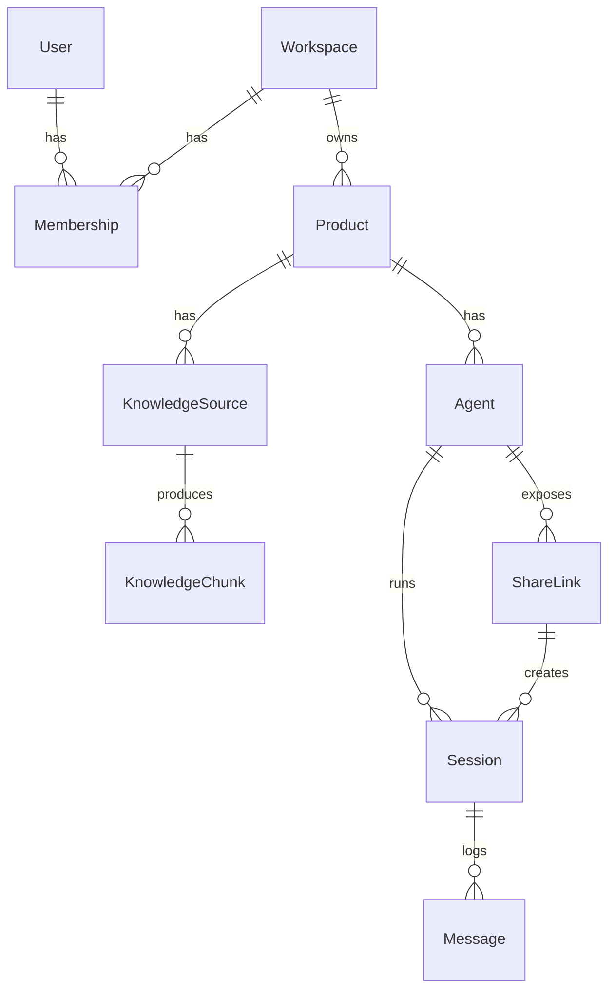

# SalesAI — Data Model & API

> Database is **MongoDB (Mongoose)**. Vector search uses **Atlas Vector Search**
> (or Qdrant). Models live in
> [`packages/database/src/models`](../packages/database/src/models).

---

## 1. Entity relationships



---

## 2. Collections

### User
`email` (unique), `passwordHash`, `name`, `avatarUrl`, `emailVerified`.

### Workspace
`name`, `slug` (unique), `ownerId`.

### Membership
`workspaceId`, `userId`, `role` ∈ `OWNER|ADMIN|EDITOR|VIEWER`. Unique per
(workspace, user).

### Product
`workspaceId`, `name`, `description`, `websiteUrl`.

### KnowledgeSource
`productId`, `type` ∈ `text|document|image|video|url|api`, `title`, `content`,
`fileKey` (S3), `url`, `status` ∈ `pending|processing|ready|failed`, `error`,
`meta` (transcript/OCR/crawl artifacts).

### KnowledgeChunk
`productId`, `sourceId`, `text`, `embedding` (`[Number]`, 3072-dim),
`modality` ∈ `text|image|video|web`, `metadata`.
Atlas index **`vector_index`** on `embedding` (cosine) with `productId` +
`modality` filters.

### Agent
`productId`, `name`, `status` ∈ `draft|active|paused|archived`,
`persona { tone, language, goals[], guardrails[] }`,
`avatarProvider` ∈ `voice-only|tavus|simli|heygen|did`,
`screenModes[]` ⊆ `none|guided-tour|customer-share`,
`toolAccess { enabled, baseUrl, openApiUrl, mcpUrl }`.

### ShareLink
`agentId`, `token` (unique), `active`, `expiresAt`, `maxSessions`,
`sessionCount`.

### Session
`agentId`, `shareLinkId`, `roomName` (LiveKit), `visitorName`,
`status` ∈ `live|ended|failed`, `screenMode`, `startedAt`, `endedAt`, `summary`.

### Message
`sessionId`, `role` ∈ `user|assistant|tool|system`, `text`, `meta`
(tool calls, citations, screen actions), `at`.

---

## 3. REST API (`/api/v1`)

> Implemented incrementally across phases; the realtime/session and knowledge
> routes exist in the scaffold today.

```
# Auth
POST   /api/v1/auth/register
POST   /api/v1/auth/login
POST   /api/v1/auth/refresh
POST   /api/v1/auth/logout

# Workspaces & products
POST   /api/v1/workspaces
GET    /api/v1/workspaces/:id
POST   /api/v1/products
GET    /api/v1/products/:id

# Knowledge
POST   /api/v1/knowledge                 # add a source -> enqueues ingestion
GET    /api/v1/knowledge/:productId      # list sources + status
POST   /api/v1/knowledge/upload-url      # presigned S3 upload (image/video/doc)
DELETE /api/v1/knowledge/:id

# Agents
POST   /api/v1/agents                     # create/configure
GET    /api/v1/agents/:id
POST   /api/v1/agents/:id/activate        # -> share link + embed snippet
POST   /api/v1/agents/:id/pause

# Sessions (public)
POST   /api/v1/sessions                   # { shareToken } -> { roomName, token, livekitUrl }
GET    /api/v1/sessions/:id/transcript

# Analytics
GET    /api/v1/analytics/agents/:id
```

Request validation uses Zod schemas from `@repo/contracts` via the `validate()`
middleware. Auth uses `requireAuth`; RBAC uses `requirePermission()`.

Current scaffold routes:
- [`sessions.js`](../apps/api/src/routes/sessions.js)
- [`knowledge.js`](../apps/api/src/routes/knowledge.js)
- [`agents.js`](../apps/api/src/routes/agents.js)

---

## 4. Socket.IO events (console live updates)

Defined in `@repo/realtime` (`RT_EVENTS`):

| Event | Direction | Payload |
|---|---|---|
| `ingestion:progress` | S->C | `{ sourceId, status, pct }` |
| `ingestion:ready` | S->C | `{ sourceId, chunks }` |
| `session:started` | S->C | `{ sessionId, agentId }` |
| `session:transcript` | S->C | `{ sessionId, role, text }` |
| `session:ended` | S->C | `{ sessionId, summary }` |

---

## 5. LiveKit room model

- Room name = `Session.roomName` (e.g. `s_ab12cd34ef`).
- Participants: `visitor_*` (customer), `agent-*` (agent-worker),
  `*-avatar-agent` (Tavus/HeyGen when server-rendered).
- Tokens minted by `@repo/livekit` `createAccessToken()` with
  `roomJoin + canPublish + canSubscribe`.
- Tracks: visitor mic, optional visitor screen-share; agent audio; avatar video;
  guided-tour video.

---

## 6. Ingestion job contract

Queue `ingestion`, job `ingest-source`:

```json
{ "sourceId": "<id>", "productId": "<id>", "type": "video" }
```

Worker extracts text by modality, then `ingestSource()` chunks, embeds, and
upserts vectors, flipping `KnowledgeSource.status` to `ready` (or `failed`).
