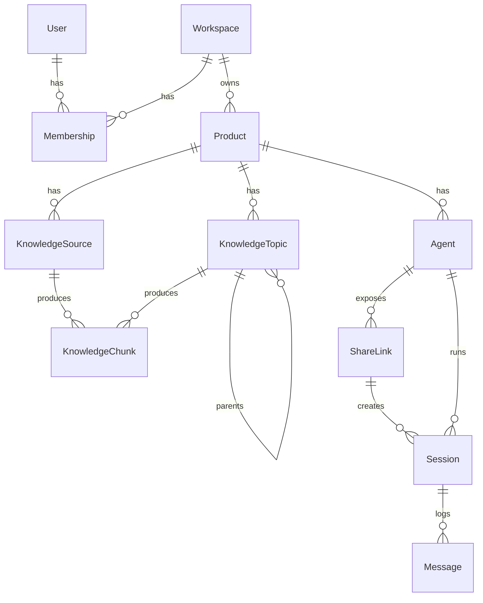

# SalesAI — Data Model & API

> Database is **MongoDB (Mongoose)**. Vector search uses **Atlas Vector Search**
> (or Qdrant). Models live in
> [`packages/database/src/models`](../packages/database/src/models).

---

## 1. Entity relationships


```mermaid
erDiagram
    User ||--o{ Membership : has
    Workspace ||--o{ Membership : has
    Workspace ||--o{ Product : owns
    Product ||--o{ KnowledgeSource : has
    KnowledgeSource ||--o{ KnowledgeChunk : produces
    Product ||--o{ KnowledgeTopic : has
    KnowledgeTopic ||--o{ KnowledgeChunk : produces
    KnowledgeTopic ||--o{ KnowledgeTopic : parents
    Product ||--o{ Agent : has
    Agent ||--o{ ShareLink : exposes
    Agent ||--o{ Session : runs
    ShareLink ||--o{ Session : creates
    Session ||--o{ Message : logs
```

---

## 2. Collections

### User
`email` (unique), `passwordHash`, `name`, `avatarUrl`, `emailVerified`.

### Workspace
`name`, `slug` (unique), `ownerId`.

### Membership
`workspaceId`, `userId`, `role` ∈ `OWNER|ADMIN|EDITOR|VIEWER`. Unique per
(workspace, user).

### Product
`workspaceId`, `name`, `description`, `websiteUrl`.

### KnowledgeSource
`productId`, `type` ∈ `text|document|image|video|url|api`, `title`, `content`,
`fileKey` (S3), `url`, `status` ∈ `pending|processing|ready|failed`, `error`,
`parentSourceId` (self-ref, set on zip-archive children — the parent zip
KnowledgeSource is a container row with no chunks of its own), `meta`
(transcript/OCR/crawl artifacts, `zipEntry`/`zipSummary`, and
`extractedText` — the exact text handed to `ingestSource()`, persisted for
every type so the Console detail modal can show/edit "what the AI actually
knows" without re-downloading/re-extracting the file; for `url`/`api`
sources also `crawlIndex.pages` — `{[url]: {rawText, links, parentUrl,
components, tabVariants}}` cache of the last crawl, so the next ingestion of the same
source can skip pages it already knows instead of re-crawling from scratch.
`parentUrl` is the page this one was discovered from (`null` for the root)
and each `links` entry is `{label, targetUrl, kind: 'link'|'button'}` (a real
`<a href>` vs. a client-routed nav button) rather than a bare URL — together
these form the **Site Yapı Ağacı** (site structure tree), exposed via `GET
/knowledge/:productId/sitemap` (NOT filtered by `status:'ready'` — a source
mid-re-crawl still carries its last successful crawl's map) and consumed by
the agent's `find_page` tool. `components` — `{headings, interactiveElements,
sections}`, DOM-only/no-LLM (`extractPageComponents()` in
`apps/worker-ingestion/src/extractors/url.js`) — is the per-page inventory
the `find_element` tool searches for a real `text=<label>` (or
`[aria-label=...]`) selector instead of the model guessing one for
`click_element`/`highlight` (see Phase 1's "Site Bilgisi" and Phase 2's tool
list). `tabVariants` — `[{label, headings, rawText}, ...]`, also DOM-only/
no-LLM (`discoverTabVariants()` in the same extractor) — captures a page
whose content is swapped by a same-page tab/panel selector (a rotating
product carousel is the motivating case: a plain crawl only ever sees
whichever panel happened to be showing at load time, leaving the other
panels' content unindexed); each variant becomes its own raw ingestion
segment tagged `metadata.tabLabel` (see `KnowledgeChunk` below), letting
`search_knowledge` surface content that's real but not on the page's
default view — `find_element`/`click_element` on that `tabLabel` is what
actually reveals it on screen; and
`ingestGeneration` — a counter bumped on every (re-)ingestion enqueue and
used as a fencing token so overlapping ingestion jobs for the same source
can't have a stale one clobber a newer one's result, see Phase 1).

### KnowledgeTopic
`productId`, `slug` (unique per product), `title`, `parentTopicId`
(self-ref, nullable — lets topics nest into a tree in the Console, e.g. a
site-specific topic under "Ürün / Hizmetler"), `body` (markdown, composed
by an LLM map-reduce pass over a URL/API crawl's pages — see Phase 1's
"Site Bilgisi"), `autoGenerated` (false for the fixed starter taxonomy,
true for a topic the crawl itself proposed), `status` ∈
`pending|processing|ready|failed`, `error`, `sourcePages[] {sourceId,
pageUrl}` (which crawled pages this topic's current `body` was composed
from), `lastContributingPages[]` (that same page-URL set, compared on each
re-ingest so an unchanged topic's expensive reduce pass can be skipped).
Cross-source, cross-page by design — unlike `KnowledgeChunk.sourceId`,
a topic is not owned by one crawl input, see `KnowledgeChunk` below.

### KnowledgeChunk
`productId`, `sourceId` **or** `topicId` (exactly one, enforced at the model
layer — a chunk belongs either to one `KnowledgeSource` or to a
cross-source `KnowledgeTopic`, see above), `text`, `embedding` (`[Number]`,
3072-dim), `modality` ∈ `text|image|video|web`, `audience` ∈
`general|technical` (auto-classified during ingestion, one cheap LLM call
per source — see Phase 1; used to bias retrieval toward the visitor's depth
preference, not to filter), `metadata` (e.g. `pageUrl` for `url`/`api`
sources — which crawled page a chunk came from, set per-segment; see Phase
1's page-grouped chunk view; `tabLabel` — set only on a segment sourced
from a page's `tabVariants` (see `KnowledgeSource` above), meaning this
chunk's content sits behind that tab/panel, not the page's default view;
`synthesized`/`scope`/`language` mark the interpretive per-page and
cross-page-overview chunks synthesized alongside the raw ones — see Phase
1's "yorumlanmış sentez katmanı"). The `search_knowledge` tool
(`packages/agent/src/tools.js`) forwards a matched chunk's `pageUrl`/
`tabLabel` straight through in its result, so the agent can `navigate_to`
and, when `tabLabel` is set, `click_element` its way to the exact spot a
fact came from instead of guessing.
Atlas index **`vector_index`** on `embedding` (cosine) with `productId` +
`modality` filters. The vector-store facade (`getVectorStore()`,
`packages/rag/src/stores/index.js`) exposes `deleteByTopic`/`listByTopic`
alongside the original `deleteBySource`/`listBySource` — **any new store
method has to be added to that facade by hand or it's silently
unreachable**, see the facade-completeness test in `stores/index.test.js`.

### Agent
`productId`, `name`, `status` ∈ `draft|active|paused|archived`,
`persona { tone, language, goals[], guardrails[] }`,
`avatarProvider` ∈ `voice-only|tavus|simli|heygen|did`,
`screenModes[]` ⊆ `none|guided-tour|customer-share`,
`toolAccess { enabled, baseUrl, openApiUrl, mcpUrl }`,
`maxParticipants` (default `1`, capped at `MAX_ROOM_PARTICIPANTS` in
`@repo/contracts`) — how many visitors this agent presents to at once, the
agent itself NOT counted. `1` keeps the original one-visitor-per-room flow
end to end; `>1` turns on the multi-participant meeting (see Phase 2 and
`02_ai_realtime_avatar_screen.md`).
`preCallSurveyEnabled` (default `false`, 1-on-1 only) — start the call with an
AI-generated adaptive questionnaire that produces a per-visitor tour plan
(§2.6 of `02_ai_realtime_avatar_screen.md`).

### ShareLink
`agentId`, `token` (unique), `active`, `expiresAt`, `maxSessions`,
`sessionCount`.

### Session
`agentId`, `shareLinkId`, `roomName` (LiveKit), `visitorName` (the PRIMARY /
first participant — analytics + lead extraction read this),
`status` ∈ `waiting|live|ended|failed` (`waiting` = multi-participant only:
the agent has joined the room but the presentation hasn't started yet;
single-participant sessions go straight to `live`), `screenMode`,
`startedAt`, `endedAt`, `lastActivityAt` (agent-worker heartbeat, updated
every 60s while the room connection is alive — lets a dead session be told
apart from a genuinely long call, see Phase 2),
`participants[] { identity, name, visitorKey, joinedAt, leftAt }` (`visitorKey`
is a stable id the visitor keeps in localStorage so a reconnect is recognised
as the same person; full roster for a
group meeting; `leftAt` stamped on disconnect, entries kept not spliced),
`maxParticipants` (pinned from `Agent.maxParticipants` at mint — a mid-meeting
config change never alters an in-progress room),
`preCallIntent` / `generatedPlan` (pre-call survey result — the LLM's read of
what the visitor wants + the per-visitor tour plan; pinned at mint from a
server-stashed `planToken`, the plan runs instead of any static `Playbook`),
`confirmedContact { name, email, phone }` (written live, once the visitor
confirms a value the agent read back to them — see `save_contact_info` tool,
Phase 2), `summary`.

A second visitor opening the SAME share link for a `maxParticipants > 1`
agent JOINs the existing room (no new `Session`, no extra agent dispatch,
`ShareLink.sessionCount` not incremented) as long as there's a free seat —
`pickSessionForJoin()` in `apps/api/src/services/share-link-sessions.js`. The
LiveKit room is pre-created with a hard cap of `maxParticipants + 1`.

### Message
`sessionId`, `role` ∈ `user|assistant|tool|system`, `text`, `meta`
(tool calls, citations, screen actions), `at`.

> The collections below are introduced in later phases; the core (above) exists
> first. See the phase docs for details.

### Analytics (Phase 4)
- **SessionSummary** — `sessionId`, `tldr`, `topics[]`, `objections[]`,
  `unanswered[]`, `sentiment`, `dropOff`, `nextStep`.
- **SessionEvent** — `sessionId`, `type`, `at`, `meta` (funnel/timeline events).
- **AnalyticsRollup** — `scope` (agent/product), `scopeId`, `bucket`, `metrics{}`.
- **Lead** — `sessionId`, `workspaceId`, `contact { email, company, name, phone }`,
  `score`, `status`, `signals[]`.
- **KnowledgeGapReport** — `productId`, `requestedBy`, `status` ∈
  `processing|ready|failed`, `sourceCount`, `truncated`, `findings[] {type ∈
  inconsistency|thin|missing, title, description, sourceIds[]}` — a
  user-triggered, LLM-driven scan of a product's own knowledge content for
  internal contradictions/thin coverage/missing topics. Not to be confused
  with `GET /analytics/knowledge-gaps` above (same "gap" wording, unrelated
  mechanism — that one aggregates real visitor questions the agent couldn't
  answer; this one needs no visitor traffic at all).

### Embed / SDK (Phase 5)
- **EmbedConfig** — `agentId`, `theme{}`, `launcher{}`, `greeting`, `micAutoPrompt`,
  `rateCaps{}`.
- **EmbedDomain** — `agentId`, `domain` (supports `*.` wildcard), `verified`.

### Billing & team (Phase 6)
- **Plan** — `key`, `name`, `stripePriceId`, `quotas{}`, `features{}`.
- **Subscription** — `workspaceId`, `planKey`, `stripeCustomerId`, `stripeSubId`,
  `status`, `periodStart/End`, `usage{}`.
- **Invitation** — `workspaceId`, `email`, `role`, `token`, `status`, `expiresAt`.
- **UsageRecord** — `workspaceId`, `meter`, `quantity`, `estCost`, `sessionId?`, `at`.

### Security & compliance (Phase 8)
- **ApiKey** — `workspaceId`, `name`, `hash`, `scopes[]`, `lastUsedAt`, `revokedAt`.
- **AuditLog** — `workspaceId`, `actorId`, `action`, `target`, `before/after`, `ip`, `at`.
- **AuthSession** — `userId`, `refreshTokenHash`, `device`, `revokedAt`, `expiresAt`.

---

## 3. REST API (`/api/v1`)

> Implemented incrementally across phases; the realtime/session and knowledge
> routes exist in the scaffold today.

```
# Auth
POST   /api/v1/auth/register
POST   /api/v1/auth/login
POST   /api/v1/auth/refresh
POST   /api/v1/auth/logout

# Workspaces & products
POST   /api/v1/workspaces
GET    /api/v1/workspaces/:id
POST   /api/v1/products
GET    /api/v1/products/:id

# Knowledge
POST   /api/v1/knowledge                 # add a source -> enqueues ingestion
GET    /api/v1/knowledge/:productId      # list sources + status
POST   /api/v1/knowledge/upload-url      # presigned S3 upload (image/video/doc)
GET    /api/v1/knowledge/:id/download-url # presigned GET for the source's file (Console preview)
GET    /api/v1/knowledge/:id/content     # meta.extractedText (backfills it if missing)
GET    /api/v1/knowledge/:id/chunks      # this source's chunks (id, text, audience, pageUrl, synthesized, scope)
PATCH  /api/v1/knowledge/:id             # rename / edit extracted text (incremental re-chunk) / replace file (re-ingests)
DELETE /api/v1/knowledge/:id
POST   /api/v1/knowledge/:productId/gap-analysis # trigger proactive content-consistency analysis (rate-limited, GAP_ANALYSIS_DAILY_LIMIT/day)
GET    /api/v1/knowledge/:productId/gap-analysis # last 10 KnowledgeGapReports + canRequestNow
GET    /api/v1/knowledge/:productId/topics       # Site Bilgisi konu ağacı (flat list, parentTopicId — client builds the tree)
GET    /api/v1/knowledge/:productId/sitemap      # Site Yapı Ağacı — page/button graph from meta.crawlIndex.pages
GET    /api/v1/knowledge/topics/:id              # one KnowledgeTopic, full body
PATCH  /api/v1/knowledge/topics/:id              # edit title/body/parentTopicId (body edit re-embeds via ingestTopicDocument)
DELETE /api/v1/knowledge/topics/:id              # deletes; re-parents children to the deleted topic's parent

# Agents
POST   /api/v1/agents                     # create/configure
GET    /api/v1/agents/:id
POST   /api/v1/agents/:id/activate        # -> share link + embed snippet
POST   /api/v1/agents/:id/pause

# Sessions (public)
GET    /api/v1/prejoin/:shareToken            # { agentName, maxParticipants, surveyEnabled }
POST   /api/v1/prejoin/:shareToken/survey     # { answers[] } -> next LLM question | { done }
POST   /api/v1/prejoin/:shareToken/finalize   # { answers[] } -> { planToken, preview[], stepCount }
POST   /api/v1/sessions                   # { shareToken, visitorName?, visitorKey?, planToken? } -> { roomName, token, livekitUrl }
GET    /api/v1/sessions/:id/transcript

# Analytics (Phase 4)
GET    /api/v1/analytics/agents/:id
GET    /api/v1/analytics/products/:id/topics
GET    /api/v1/analytics/leads
GET    /api/v1/sessions/search?q=

# Embed / SDK (Phase 5)
POST   /api/v1/agents/:id/embed
GET    /api/v1/embed/:token/config        # public, origin-checked
POST   /api/v1/embed/:token/session       # public, origin + rate limited
GET    /sdk/salesai.js                     # versioned loader script

# Team & billing (Phase 6)
POST   /api/v1/workspaces/:id/invitations
POST   /api/v1/invitations/:token/accept
PATCH  /api/v1/memberships/:id
DELETE /api/v1/memberships/:id
POST   /api/v1/billing/checkout
POST   /api/v1/billing/portal
POST   /api/v1/billing/webhook            # Stripe (raw body, signature verified)
GET    /api/v1/billing/usage

# Security & privacy (Phase 8)
POST   /api/v1/auth/2fa/enable | /verify | /disable
POST   /api/v1/api-keys
DELETE /api/v1/api-keys/:id
POST   /api/v1/privacy/export
POST   /api/v1/privacy/delete
GET    /api/v1/audit-logs
```

Request validation uses Zod schemas from `@repo/contracts` via the `validate()`
middleware. Auth uses `requireAuth`; RBAC uses `requirePermission()`.

Current scaffold routes:
- [`sessions.js`](../apps/api/src/routes/sessions.js)
- [`knowledge.js`](../apps/api/src/routes/knowledge.js)
- [`agents.js`](../apps/api/src/routes/agents.js)

---

## 4. Socket.IO events (console live updates)

Defined in `@repo/realtime` (`RT_EVENTS`):

| Event | Direction | Payload |
|---|---|---|
| `ingestion:progress` | S->C | `{ sourceId, status, pct }` |
| `ingestion:ready` | S->C | `{ sourceId, chunks }` |
| `session:started` | S->C | `{ sessionId, agentId }` |
| `session:transcript` | S->C | `{ sessionId, role, text }` |
| `session:ended` | S->C | `{ sessionId, summary }` |
| `session:summary` | S->C | `{ sessionId, tldr, topics, sentiment }` (Phase 4) |
| `lead:created` | S->C | `{ leadId, sessionId, score }` (Phase 4) |
| `billing:updated` | S->C | `{ workspaceId, planKey, status }` (Phase 6) |

---

## 5. LiveKit room model

- Room name = `Session.roomName` (e.g. `s_ab12cd34ef`).
- Participants: `visitor_*` (customer), `agent-*` (agent-worker),
  `*-avatar-agent` (Tavus/HeyGen when server-rendered).
- Tokens minted by `@repo/livekit` `createAccessToken()` with
  `roomJoin + canPublish + canSubscribe`.
- Tracks: visitor mic, optional visitor screen-share; agent audio; avatar video;
  guided-tour video.

---

## 6. Ingestion job contract

Queue `ingestion` (worker concurrency 3, `apps/worker-ingestion/src/main.js`),
job `ingest-source`:

```json
{ "sourceId": "<id>", "productId": "<id>", "type": "video", "generation": 2 }
```

Always enqueued via `apps/api/src/lib/ingestion.js`'s `enqueueIngestion()`,
never `enqueue()` directly — it atomically bumps
`KnowledgeSource.meta.ingestGeneration` and stamps the new value as
`generation` on the job. Because concurrency > 1, two ingestion requests for
the same source (e.g. product creation's anonymous crawl and, moments
later, the first agent's language becoming known) can run in parallel and
finish in either order; `handleIngestSource()` re-checks `generation`
against the source's current `meta.ingestGeneration` right before
persisting its result and no-ops (`{ chunks: 0, superseded: true }`) if a
newer request has since landed — the most-recently-enqueued request always
wins regardless of processing order (fencing-token pattern).

Worker extracts text by modality, then `ingestSource()` chunks, embeds, and
upserts vectors, flipping `KnowledgeSource.status` to `ready` (or `failed`).
For `url`/`api` sources this also runs the crawl-cache/synthesis pipeline
described in Phase 1 (`md/backend/phase1_rag_ingestion.md`).
