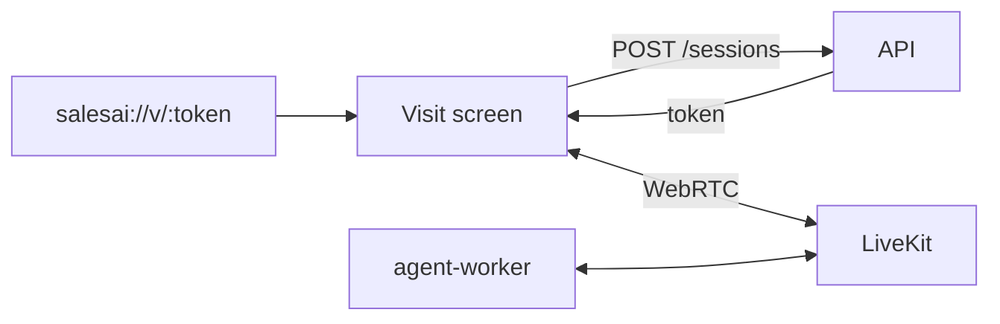

# Mobile — Phase 1: Visitor App (Expo)

> App: [`apps/mobile`](../../apps/mobile) (Expo + Expo Router + LiveKit RN).
> Goal: the visitor experience on iOS/Android — open a link, talk to the AI rep
> with voice + avatar video.

---

## Scope

- Expo Router app with a deep-linkable visitor screen.
- LiveKit React Native client (audio + avatar video).
- Mic permissions; reconnection; captions.
- Later phases: customer screen share (where the OS allows), console-lite.

---

## Architecture

- `@livekit/react-native` + `@livekit/react-native-webrtc` for WebRTC.
- Reuse `@repo/contracts` for request/response shapes; call the same
  `POST /sessions` endpoint as the web visitor.
- Deep link `salesai://v/:token` and universal links map to the visit screen.

---

## Screens

| Screen | Purpose |
|---|---|
| `index` | Branded landing / enter or open a link |
| `v/[token]` | Join room, render avatar video + audio, captions, mute, end |

---

## Permissions & platform notes

- iOS: microphone usage description; background audio mode for calls.
- Android: `RECORD_AUDIO`; foreground service for ongoing calls.
- Screen capture of the customer's device is limited by OS APIs; treat mode B as
  best-effort on mobile (often web-first).

---

## Acceptance criteria

- Opening a deep link starts a session and connects to the room.
- Two-way voice works; the avatar video renders for video providers.
- Captions show the live transcript; mute/end work reliably.

---

## Later (Phase 4)

- Push notifications, saved conversations, and a console-lite for sellers to
  monitor sessions on the go.
