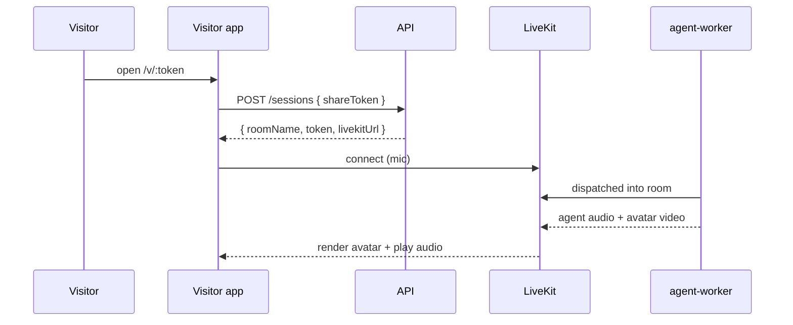

# Web — Phase 2: Visitor Experience

> App: [`apps/visitor`](../../apps/visitor) (React 19 + Vite + LiveKit).
> Goal: a polished, zero-friction page where a customer talks to the AI rep with
> voice and a visual avatar.

---

## Scope

- [x] `/v/:token` route: auto-create session, join LiveKit room, render agent.
- [x] Avatar rendering per provider config.
- [x] Mic permission + connection states; captions; end-session.
- [x] Embeddable mode (`?embed=1`) for the SDK widget iframe.

---

## Flow

See [`Visit.jsx`](../../apps/visitor/src/Visit.jsx).

---

## Avatar rendering

- `voice-only`: 2D orb/waveform driven by the agent audio track levels.
- `tavus`/`heygen`/`did`: subscribe to the avatar's **video track** and render it.
- `simli`: initialize `simli-client` in LiveKit mode with `faceId` from
  `getClientConfig()`.

The app reads the provider config returned with the session and picks the
renderer accordingly.

---

## UX details

- Pre-join: friendly intro + "Allow microphone" with clear copy.
- In-call: avatar centered, live captions, mute, "share my screen", end.
- Screen-share button publishes the visitor's screen track (enables mode B).
- Errors: mic blocked, link expired, agent paused -> graceful messages.

---

## Acceptance criteria

- [x] Open a link, allow mic, and hold a two-way voice conversation.
- [x] The avatar renders correctly for the agent's configured provider.
- [x] Captions reflect the live transcript.
- [x] `?embed=1` renders cleanly inside the SDK iframe.
