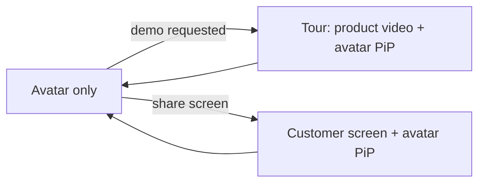

# Web — Phase 3: Screen Intelligence UI

> Goal: the visitor UI surfaces both screen modes — the agent's guided tour and
> the customer's own screen share — alongside the avatar.

---

## Scope (visitor app)

- [x] **Guided tour view**: render the agent-driven product video track with a
  "the AI is showing you …" indicator and highlight overlays.
- [x] **Customer screen share**: a prominent "Share my screen" control; show a
  thumbnail of what's shared and an indicator when the agent is "looking".
- [x] Layout that adapts between avatar-only, tour, and split (avatar + screen).

---

## Layout modes

- **Avatar only** — default conversation.
- **Tour** — product video fills the stage, avatar as picture-in-picture, with
  highlight outlines synced to `highlight()` calls.
- **Customer share** — the customer's screen is the stage; a subtle pulse shows
  when the agent samples a frame (`read_customer_screen`).

---

## Signaling

- The agent-worker announces mode changes via LiveKit data messages /
  participant metadata; the UI switches layout accordingly.
- Highlights can be sent as data messages (`{ type: 'highlight', selector }`)
  for overlay rendering when the tour runs client-side, or are baked into the
  published frames when server-rendered.

---

## Privacy & trust

- Explicit consent before screen sharing; clear "agent is viewing" state.
- No frame persistence by default; show this to the user.

---

## Acceptance criteria

- [x] Requesting a demo switches to the tour layout with synced highlights.
- [x] Sharing a screen switches to the customer-share layout with a viewing
  indicator, and the agent gives accurate, position-aware guidance.
- [x] Returning to plain Q&A restores the avatar-only layout.
