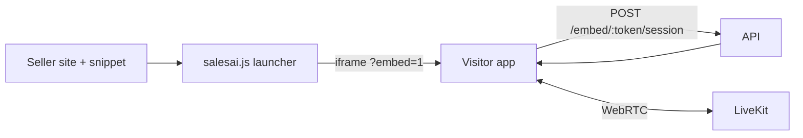

# Web — Phase 6: Embed Studio & Widget

> Apps: [`apps/console`](../../apps/console) (studio) + [`apps/visitor`](../../apps/visitor)
> (`?embed=1` mode) + [`@repo/sdk`](../../packages/sdk) (loader).
> Goal: sellers style and configure the embeddable widget, copy a snippet, and
> drop the AI rep onto their own site. Backed by backend Phase 5.

---

## Scope

- Embed Studio in the console: theme, launcher, greeting, domain allowlist.
- Live preview of the widget bubble + panel.
- Copy-paste snippet generation.
- Visitor app `?embed=1` layout tuned for iframe use.
- SDK loader UX (launcher button, open/close, unread greeting).

---

## Studio (console) — `/agents/:id/embed`

| Control | Effect |
|---|---|
| Theme | Primary color, light/dark, radius, font -> `EmbedConfig.theme` |
| Launcher | Position (corner), label, icon, greeting bubble |
| Behavior | Mic auto-prompt, open-on-load, rate caps |
| Domains | Allowlist (`acme.com`, `*.acme.com`) with verification state |
| Snippet | Generated `<script>` tag with the embed token + version |

- **Live preview** renders the actual loader against the current config so
  changes are visible immediately.
- **Snippet**:

```html
<script src="https://cdn.salesai.app/sdk/salesai.js"
        data-embed-token="EMBED_TOKEN" async></script>
```

---

## Visitor `?embed=1` mode

- Chromeless layout: no site header/footer; fills the iframe.
- Compact pre-join (inline mic prompt), avatar + captions, mute/end.
- Respects theme passed via the embed config (color, radius, dark mode).
- Posts `resize`/`close` messages to the parent loader via `postMessage`.

---

## SDK loader (`@repo/sdk`)

- Injects a floating launcher button; on click opens an iframe panel to the
  visitor app in embed mode with the token.
- Handles open/close, greeting bubble, mobile full-screen, and `postMessage`
  bridge (resize, close, analytics events).
- Minimal footprint, no framework, versioned + CDN-cached.



---

## Acceptance criteria

- Editing theme/launcher/greeting updates the live preview instantly.
- The generated snippet, pasted on an allowlisted domain, opens a working widget.
- A non-allowlisted domain shows a clear "not authorized" state.
- Embed mode renders chromelessly and adapts to the configured theme.
- The launcher opens/closes smoothly and goes full-screen on mobile.

---

## Risks

- **CSP conflicts** — document required host-site CSP; test on strict sites.
- **iframe sizing** — rely on `postMessage` resize; handle mobile viewport.
- **Theme mismatch** — constrain theming tokens to keep contrast/accessibility.
